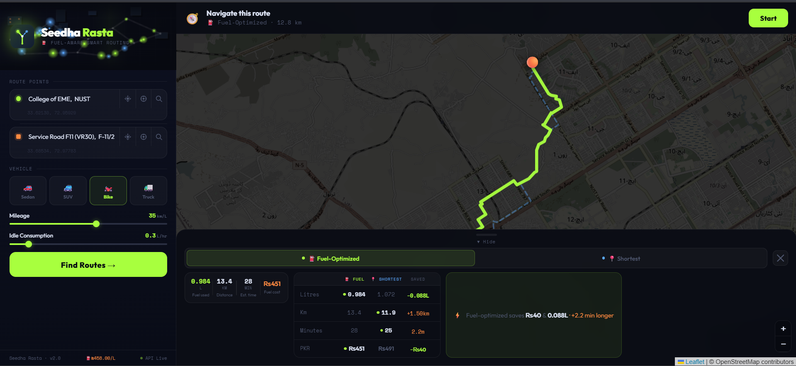

# 🚗 Seedha Rasta — Fuel-Optimized Routing Engine

Seedha Rasta is an intelligent routing system that goes beyond shortest-path navigation by optimizing routes based on **fuel consumption**, factoring in **traffic-induced idling** and **vehicle-specific efficiency**.

> Traditional maps minimize time or distance.  
> **Seedha Rasta minimizes fuel cost.**

---

## 🧠 Core Idea

Fuel consumption is not just a function of distance — traffic plays a major role.

This system models:

Fuel Cost = Distance Fuel + Idle Fuel

- **Distance Fuel** → Based on mileage (km/L)
- **Idle Fuel** → Derived from traffic intensity and idle consumption rate

---

## ✨ Features

- ⛽ Fuel-optimized route computation  
- 🧠 A* pathfinding with custom cost function  
- 🚦 Traffic-aware routing (idle time modeling)  
- 🚗 Custom mileage + idle consumption
- 🔄 Shortest vs Fuel-efficient route comparison  
- 📍 Nearest node mapping using coordinates  
- 🗺️ Interactive React-based visualization  
- ⚙️ Preprocessed graph (distance, speed, travel time)

---

## 🏗️ System Architecture

### Frontend
- React (Vite)
- Tailwind CSS
- Interactive route visualization

### Backend
- Django + Django REST Framework
- Custom routing engine (A* algorithm)

### Data Layer
- OpenStreetMap (OSM)
- OSMnx for graph extraction

### DevOps
- 🐳 Dockerized a three tier application using multi stage builds for efficiency.
- 🔄 Built a CI/CD pipeline via GitHub Actions.
- ☁️ Deployed on AWS ECS (Elastic Container Service)

---

## ⚙️ How It Works

### 1. Input
User provides:
- Source & destination (lat/lng)
- Vehicle type
- Mileage and Idle fuel consumption
- Fuel Price in Pakistan are loaded at startup. (Used for calculating fuel efficient route. Limited to Pakitan.)

### 2. Graph Preparation
- Road network loaded from OSM
- Each edge enriched with:
  - Distance
  - Speed
  - Travel time

### 3. Traffic Modeling
- Traffic factor ∈ [0,1]
- Idle time = traffic × travel time

### 4. Pathfinding

Two routes are computed:
- **Shortest Path** → minimizes distance
- **Fuel Optimized Path** → minimizes:


## 📸 Preview



---

## 🚀 Getting Started

### 🔧 Run Locally via Docker

```bash
git clone https://github.com/HopzAlot/seedha-rasta.git
cd seedha-rasta
git checkout containerized

docker-compose up --build
```

## 🌐 Services (Local)

- Frontend: http://localhost:5173  
- Backend API: http://localhost:8000  

---

## ⚠️ Limitations

- Traffic is simulated (not real-time yet)  
- Fuel estimation is approximate  
- OSM dataset scope may vary  

---

## 🔮 Future Improvements

- Real-time traffic APIs integration  
- ML-based congestion prediction  
- Advanced vehicle modeling  
- Distributed caching (Redis)  
- Kubernetes migration (optional scaling path)  

---

**This was just a random idea which popped in my head pertaining the current Fuel Crisis occuring in the worlrd especially in Pakistan. I wanted to analyze how different routes affect fuel consumption and how we can efficiently save fuel as much as we can. This in no way replaces Google Maps as Maps take into account alot of other factors too especially Real time Traffic data which contributes highly in finding better routes while i just simulate the traffic randomly. This project was purely for experimentation and learning purposes.**


## 🧑‍💻 Author

**Rehan Saqib**

- GitHub: https://github.com/HopzAlot  
- Email: rehasaqib2006@gmail.com  

---

## 🤝 Contributing

1. Fork the repo  
2. Create a feature branch  
3. Commit changes  
4. Open a pull request  

---

## 📜 License

MIT License